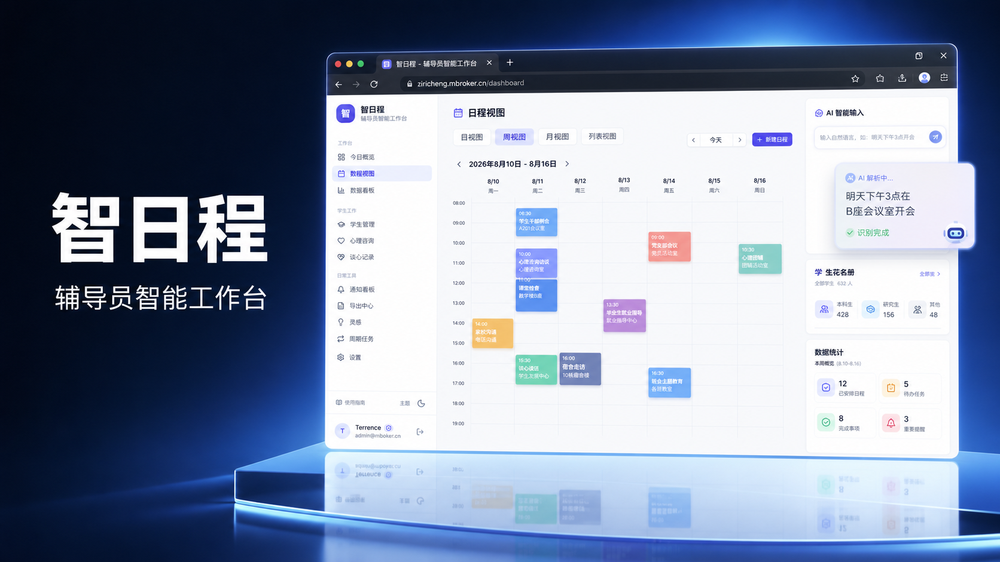

# 智日程 · 辅导员智能工作台 (ZhiRicheng)

AI 驱动的高校辅导员智能工作台，覆盖日程任务、学生花名册、谈心谈话、通知与材料上报全流程，集成飞书自动提醒与每日简报。

## 界面预览




## 功能

### 核心能力

| 功能 | 说明 |
|------|------|
| **NLP 任务创建** | 输入 "明天下午3点在B座会议室开会" → AI 自动解析时间、地点、类型 |
| **文档批量提取** | 粘贴学校通知全文 → 自动提取所有截止节点和材料要求 |
| **邮件字段识别** | 识别通知中的收件邮箱、邮件主题、附件清单 |
| **子任务拆分** | 一键将复杂任务拆解为可执行的子步骤 |
| **自然语言查询** | "这周有哪些高优任务？" → AI 回答 |
| **冲突检测** | 创建任务时自动检测时间重叠并提示 |

### 任务管理

| 功能 | 说明 |
|------|------|
| 日/周/月视图 | 日历三视图切换，颜色标识优先级 |
| 状态流转 | 待办 → 进行中 → 完成，点击圆圈切换 |
| 拖拽排序 | 按优先级排列，支持后端持久化 |
| 分类标签 | 资料收集 / 审核 / 会议 / 通用 |
| 地点标记 | 记录会议室、教室等位置信息 |
| 提醒开关 | 每个任务可独立控制是否推送提醒 |

### 辅导员专属模块（新增）

| 模块 | 说明 |
|------|------|
| **学生花名册** | 按班级管理学生（学号/联系方式/宿舍/关注标签），支持搜索、批量 JSON 导入 |
| **谈心谈话记录** | 每个学生可记录多条谈心（日常/学业/心理/违纪/就业），形成时间线 |
| **通知与材料上报看板** | 按状态（待处理/进行中/已完成）分栏；粘贴通知全文 → AI 提取标题/来源/截止/材料清单，可一键创建关联任务；材料项逐项勾选「已上报」，全部完成后自动置为已完成 |

### 灵感记录

| 渠道 | 方式 |
|------|------|
| Web 页面 | 侧边栏 → 灵感 → 输入即存 |
| 飞书机器人 | 发 `灵感 可以做学生成绩预警看板` → 自动存入 |

### 飞书集成

| 能力 | 说明 |
|------|------|
| **消息添加任务** | @机器人发送自然语言，自动解析并创建 |
| **灵感记录** | 以 `灵感` 开头发送，自动存入灵感列表 |
| **台账跟进记录** | 发送「台账跟进 张三：内容」自动给指定学生添加心理台账跟进记录，自动标记台账学生（详见下方示例） |
| **学生信息查询** | 发送「查张三」「台账列表」等自然语言查询学生信息 |
| **原生提醒** | 创建飞书任务，到时间弹出原生通知 |
| **文字提醒** | 提前 N 分钟发送文字消息提醒（时间可调，持久化去重） |
| **每日简报** | 早 8 点自动推送当日任务摘要（持久化，重启不重复/漏发） |
| **WebSocket 长连接** | 无需公网 IP，本地即可开发调试，断线自动重连 |

**飞书自然语言台账跟进示例**（发消息给机器人）：

```
台账跟进 xxx：今天谈话情绪稳定多了，愿意继续咨询
给xxx添加台账跟进：家长已联系，建议心理咨询中心介入
记录 xxx 的心理跟进：成绩有所回升
```

- 支持按姓名或学号定位学生；多学生重名时会列出候选让你选择
- 未在台账中的学生会**自动纳入台账**并建档
- 也支持「昨天」「2026年8月5日」等日期描述（不写默认当天）

### UI

| 特性 | 说明 |
|------|------|
| 现代专业 SaaS 风 | 靛蓝主色、柔和阴影、清晰层次、圆角卡片 |
| 亮/暗双主题 | 真正可用的深色模式，跟随系统或手动切换，全组件适配 |
| 响应式布局 | 桌面固定侧栏 / 移动端汉堡抽屉，主区可滚动 |
| 动画过渡 | Framer Motion，任务增删、抽屉、Toast 均有动画 |
| 无障碍 | 焦点环、对话框焦点陷阱、Escape 关闭、aria 标签 |
| 全局 Toast | 统一的成功/错误/信息提示，替代散落的静默吞错 |

### 安全（本轮重点修复）

| 修复 | 说明 |
|------|------|
| 备份接口 RCE 消除 | 移除 `sqlite3 .dump` / 管道执行任意 SQL；改为二进制 .db 文件复制 + 魔数校验；**仅管理员**可备份/恢复 |
| 密钥泄漏修复 | `GET /api/settings` 不再返回明文 DeepSeek Key，仅返回 `hasDeepSeekKey` 布尔 |
| 角色权限 | 新增 `User.role` 字段（user/admin），`requireAdmin` 中间件，替代硬编码邮箱鉴权 |
| JWT 硬化 | 非 production/test 环境也拒绝默认空密钥；refresh 轮换改为事务+计数防并发重放 |
| 错误信息硬化 | 500 错误统一返回「服务器内部错误」，不向客户端泄漏 stack/Prisma 细节 |
| 接口限流 | LLM 类接口与 IM 接口加 express-rate-limit |
| 输入校验 | 任务创建/更新字段白名单过滤（zod + sanitize），防越权写入 |

---

## 技术栈

| 层 | 选型 |
|----|----|
| 前端框架 | React 19 + TypeScript |
| 构建工具 | Vite 5 |
| UI 样式 | TailwindCSS 3（靛蓝主色 + slate 中性色 + darkMode:class） |
| 动效 | Framer Motion |
| 状态管理 | Zustand |
| 后端框架 | Express + TypeScript |
| ORM | Prisma |
| 数据库 | SQLite（可切换 PostgreSQL） |
| 认证 | JWT (access + refresh token，role 携带在 token) |
| LLM | DeepSeek API (OpenAI SDK 兼容) |
| 飞书 SDK | @larksuiteoapi/node-sdk |
| 校验 | zod（请求体校验） |

---

## 快速开始

### 环境要求

- Node.js >= 20
- 飞书开发者账号（可选，用于飞书功能）

### 1. 克隆项目

```bash
git clone https://github.com/terrenceftz/zhi-richeng.git
cd zhi-richeng
```

### 2. 安装依赖

```bash
npm install
cd server && npm install && cd ..
cd client && npm install && cd ..
```

### 3. 配置环境

编辑 `server/.env`：

```env
DATABASE_URL="file:./dev.db"
JWT_ACCESS_SECRET="你的访问密钥"
JWT_REFRESH_SECRET="你的刷新密钥"
DEEPSEEK_API_KEY="sk-xxxxxxxxxxxxxxxx"
PORT=3001
CLIENT_URL="http://localhost:5173"
FEISHU_APP_ID=""      # 飞书应用 ID（可选）
FEISHU_APP_SECRET=""  # 飞书应用密钥（可选）
```

### 4. 初始化数据库

```bash
cd server
npx prisma db push
npx prisma db seed
```

### 5. 启动

```bash
# 项目根目录
npm run dev
```

| 服务 | 地址 |
|------|------|
| 前端 | http://localhost:5173 |
| 后端 | http://localhost:3001 |

### Demo 账号

- 邮箱：`demo@zhi.com`
- 密码：`123456`

### 6. Docker 部署（可选）

项目内置双容器部署方案（server + client/nginx），生产环境要求配置强 JWT 密钥（`config.ts` 会拒绝默认值）：

```bash
# 根目录创建 .env（参考 server/.env.example）
JWT_ACCESS_SECRET=<强随机串>
JWT_REFRESH_SECRET=<强随机串>
DEEPSEEK_API_KEY=sk-xxx            # 可选
FEISHU_APP_ID=cli_xxx              # 可选
FEISHU_APP_SECRET=xxx              # 可选

docker compose up -d --build
```

- 访问 `http://localhost`（client 80 端口），API 由 nginx 反代到 server:3001
- 数据库（`server_data`）与自动备份（`server_backups`）均为持久化 volume
- 首次启动自动执行 `prisma db push` 同步表结构（幂等，不删数据）

### 自动备份

服务端每小时检查一次，**每天自动备份 SQLite 数据库**到 `backups/auto-YYYY-MM-DD.db`（幂等，保留最近 7 天）。
手动下载 / 恢复数据库见「设置 → 数据备份」。

---

## 项目结构

```
zhi-richeng/
├── client/                        # Vite + React 18 前端
│   └── src/
│       ├── api/                   # Axios 实例 + API 请求
│       ├── components/
│       │   ├── calendar/          # 日历组件（日/周/月/迷你）
│       │   ├── layout/            # 布局组件（侧边栏/认证布局）
│       │   ├── tasks/             # 任务组件（卡片/列表/表单）
│       │   ├── ui/                # 基础 UI（按钮/输入框/弹窗）
│       │   ├── AIChatBar.tsx      # AI 查询栏
│       │   └── SmartInput.tsx     # NLP 智能输入
│       ├── pages/                 # 页面组件
│       ├── stores/                # Zustand 状态管理
│       ├── types/                 # TypeScript 类型定义
│       ├── App.tsx                # 路由配置
│       └── index.css              # TailwindCSS + 主题变量
├── server/                        # Express + Prisma 后端
│   ├── prisma/
│   │   ├── schema.prisma          # 数据模型
│   │   └── seed.ts                # 种子数据
│   └── src/
│       ├── controllers/           # 请求处理
│       ├── middleware/             # 认证 + 错误处理
│       ├── routes/                # API 路由
│       ├── services/              # 业务逻辑
│       │   ├── llm.service.ts     # DeepSeek LLM 调用
│       │   ├── feishu.service.ts  # 飞书 WebSocket + API
│       │   ├── reminder.service.ts # 提醒调度
│       │   ├── digest.service.ts  # 每日摘要
│       │   ├── tasks.service.ts   # 任务 CRUD
│       │   └── auth.service.ts    # 认证逻辑
│       ├── utils/                 # JWT + 密码工具
│       └── db.ts                  # Prisma 单例
└── docs/                          # 设计文档
```

---

## API 文档

### 认证

| 方法 | 路径 | 说明 |
|------|------|------|
| POST | /api/auth/register | 注册 `{ email, password, name }` |
| POST | /api/auth/login | 登录 `{ email, password }` → tokens |
| POST | /api/auth/refresh | 刷新 access token |
| POST | /api/auth/logout | 注销 |

### 任务

| 方法 | 路径 | 说明 |
|------|------|------|
| GET | /api/tasks | 列表 `?date=&status=&priority=&category=` |
| POST | /api/tasks | 创建 |
| GET | /api/tasks/:id | 详情 |
| PUT | /api/tasks/:id | 更新 |
| DELETE | /api/tasks/:id | 删除 |
| PATCH | /api/tasks/:id/status | 切换状态 |
| POST | /api/tasks/nlp | NLP 解析单条 |
| POST | /api/tasks/nlp/extract | 文档批量提取 |
| POST | /api/tasks/nlp/confirm | 确认 NLP 结果入库 |
| POST | /api/tasks/:id/decompose | AI 拆解子任务 |
| POST | /api/tasks/query | 自然语言查询 |
| POST | /api/tasks/:id/conflict | 冲突检测 |
| PATCH | /api/tasks/reorder | 拖拽排序 |

### 灵感

| 方法 | 路径 | 说明 |
|------|------|------|
| GET | /api/ideas | 列表 |
| POST | /api/ideas | 创建 `{ content, source? }` |
| DELETE | /api/ideas/:id | 删除 |

### 学生花名册（新增）

| 方法 | 路径 | 说明 |
|------|------|------|
| GET | /api/students | 列表 `?q=&className=` |
| GET | /api/students/classes | 所有班级（去重） |
| GET | /api/students/:id | 详情（含谈心记录） |
| POST | /api/students | 创建 |
| PUT | /api/students/:id | 更新 |
| DELETE | /api/students/:id | 删除 |
| POST | /api/students/import | 批量导入（JSON 数组） |

### 谈心谈话（新增）

| 方法 | 路径 | 说明 |
|------|------|------|
| GET | /api/counseling | 列表 `?studentId=&from=&to=` |
| POST | /api/counseling | 创建 `{ studentId, date, type, content, followUp? }` |
| PUT | /api/counseling/:id | 更新 |
| DELETE | /api/counseling/:id | 删除 |

### 通知与材料上报（新增）

| 方法 | 路径 | 说明 |
|------|------|------|
| GET | /api/notices | 列表 `?status=` |
| GET | /api/notices/:id | 详情 |
| POST | /api/notices | 创建 |
| PUT | /api/notices/:id | 更新 |
| PATCH | /api/notices/:id/materials/:index | 切换材料项上报状态 `{ submitted }` |
| DELETE | /api/notices/:id | 删除 |
| POST | /api/notices/from-text | AI 解析通知文本生成通知（可选创建关联任务） |

### 设置

| 方法 | 路径 | 说明 |
|------|------|------|
| GET | /api/settings | 获取配置 |
| PUT | /api/settings | 更新配置 |
| POST | /api/settings/regenerate-im-token | 重新生成 IM token |

### 用户

| 方法 | 路径 | 说明 |
|------|------|------|
| GET | /api/users/me | 个人信息（含 role） |
| PUT | /api/users/me | 更新信息 `{ name?, password? }` |
| GET | /api/users | 列出全部用户（仅管理员） |
| DELETE | /api/users/:id | 删除用户（仅管理员） |

### 备份（仅管理员）

| 方法 | 路径 | 说明 |
|------|------|------|
| GET | /api/backup | 下载 sqlite .db 文件（二进制，非 SQL） |
| POST | /api/backup/restore | 上传 .db 文件恢复（魔数校验，不执行任意 SQL） |

---

## 飞书集成配置

### 获取凭证

1. 访问 [飞书开放平台](https://open.feishu.cn)
2. 创建企业自建应用
3. 添加「机器人」能力
4. 权限管理 → 开通：`im:message`、`im:message:send_as_bot`、`im:message.p2p_msg`、`task:task`
5. 事件与回调 → 订阅方式选「使用长连接接收事件」→ 添加 `im.message.receive_v1`
6. 发布应用 → 创建版本 → 申请上线
7. 复制 App ID 和 App Secret

### 应用内配置

1. 打开智日程 → 设置 → 飞书互联
2. 填入 App ID 和 App Secret → 保存凭证
3. 给飞书机器人发消息 → 获取返回的 OpenID
4. 将 OpenID 填入设置页 → 绑定

### 使用

- 飞书 @机器人 → 发消息自动创建任务
- 发 `灵感 xxx` → 自动存入灵感记录
- 带时间任务自动创建飞书原生提醒

---

## 数据模型

| 模型 | 说明 |
|------|------|
| User | 用户（邮箱、密码、昵称、role 角色） |
| Task | 任务（标题、描述、地点、优先级、状态、类型、截止日期/时间、标签、提醒开关、子任务、sortOrder） |
| RefreshToken | JWT 刷新令牌（带 expiresAt，定时清理） |
| Setting | 键值对配置（API Key 掩码、飞书凭证等） |
| Idea | 灵感记录（内容、来源、时间） |
| Student | 学生花名册（姓名、学号、班级、性别、电话、宿舍、关注标签、备注） |
| Counseling | 谈心谈话记录（学生、日期、类型、内容、跟进） |
| Notice | 通知与材料上报（标题、来源、截止、材料清单 JSON、状态、关联 taskId） |
| ReminderLog | 提醒/简报发送去重（taskId + key 唯一，持久化） |

---

## License

MIT
